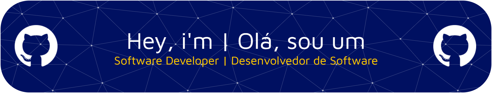

<!--  ============================================================
     THIAGO JESUS DIAS — GitHub Profile README
     Color: Background ##001061 | Aesthetic: GitHub
     =========================================================== -->

<!-- ─── HERO BANNER ─────────────────────────────────────────── -->

<!-- HEY, NICE SEE YOU (WITH EMOJI) -->

  <h1 > Hey, nice to see you.</h1>

<!-- TYPING TAGLINE -->

<!-- ─── ABOUT ME ───────────────────────────────────────────────── -->

<!-- ─── WHO AM I — TWO CARDS SIDE BY SIDE ──────────────────────
     LEFT  : styled info card
     RIGHT : profile photo placeholder
     ─────────────────────────────────────────────────────────── -->

<table width="100%" border="0" cellspacing="12" cellpadding="10">
<tr>
<td width="55%" valign="middle">

### 👨🏾‍💻〔 About Me 〕

|                  |                                              |
| ---------------- | -------------------------------------------- |
| 💼 **Role**      | Data Scientist - Software Developer          |
| 📍 **Location**  | Brasil - São Paulo                           |
| 🧠 **Learning**  | Artificial Intelligence & Machine Learning   |
| 🚀 **Currently** | Exploring Data Structures & Algorithms       |
| 🌱 **Fun fact**  | I'm a Scout! and I LOVE nature!              |
| 📬 **Email**     | thiago13jesusdias@gmail.com                  |
| 💬 **Mantra**    | _"Data is just stories waiting to be told."_ |

<!-- GITHUB STREAK DENTRO DA TABLE -->

</td>

<!-- RESPONSÁVEL PELA CENTRALIZAÇÃO DA TABLE -->
<td width="45%" valign="middle" align="center">

<!-- my photo/ gif -->

<table width="100%">
</table>

<!-- NOME E SOCIAL MEDIAS ABAIXO DA FOTO -->

_Thiago Jesus Dias_
 

      
      
      
</td>
</tr>
</table>
</table>

<!-- TECH ECOSYSTEM DOG AND CAT -->

<h2 align="center">
  
  Tech Ecosystem
  
</h2>

###

<!-- TECHNOLOGIES -->

  
  
  
  
  
  
  
  
  
  
  
  
  
  
  
  
  
  
  
  
  
  
  
  
  
  
  
  
  
  
  
  
  
  
  
  
  

---

<!-- PACMAN CONTRIBUCTION -->

<picture>
  <source media="(prefers-color-scheme: dark)" srcset="https://raw.githubusercontent.com/Jegro777/Jegro777/output/pacman-contribution-graph-dark.svg">
  <source media="(prefers-color-scheme: light)" srcset="https://raw.githubusercontent.com/Jegro777/Jegro777/output/pacman-contribution-graph.svg">
  
</picture>

<!-- PROFILE VIEWS - EMOJIS -->

  <h3 align="center">
       &nbsp;&nbsp;&nbsp;&nbsp;
       &nbsp;&nbsp;&nbsp;&nbsp;
       
   </h3>
   

