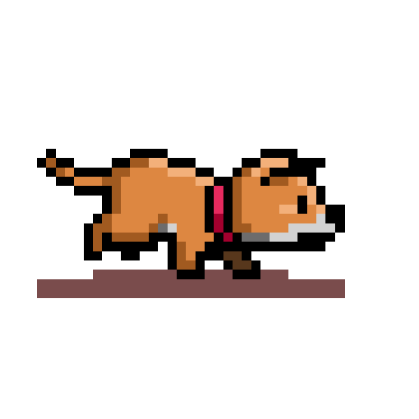

<!--  ============================================================
     THIAGO JESUS DIAS — GitHub Profile README
     Color: Background ##001061 | Aesthetic: GitHub
     =========================================================== -->

<!-- ─── HERO BANNER ─────────────────────────────────────────── -->

<!--

-->

[**English version // Versão em inglês**](README-eng.md)

<!-- HEY, NICE SEE YOU (WITH EMOJI) -->

  <h1 > Olá, Prazer em te ver por aqui!</h1>

<!-- TYPING TAGLINE -->

<!-- ─── ABOUT ME ───────────────────────────────────────────────── -->

<!-- ─── WHO AM I — TWO CARDS SIDE BY SIDE ──────────────────────
     LEFT  : styled info card
     RIGHT : profile photo placeholder
     ─────────────────────────────────────────────────────────── -->

<table width="100%" border="0" cellspacing="12" cellpadding="10">
<tr>
<td width="55%" valign="middle">

### 👨🏾‍💻〔 Sobre Mim 〕

|                    |                                                               |
| ------------------ | ------------------------------------------------------------- |
| 💼 **Atuação**     | Engenheiro de Dados & Desenvolvedor de Software                |
| 📍 **Localização** | Brasil - São Paulo                                            |
| 🧠 **Aprimorando** | AWS Cloud & Machine Learning                                  |
| 🚀 **Explorando**  | Estruturas de Dados & Algoritmos                              |
| 🌱 **Curiosidade** | Sou escoteiro e apaixonado pela natureza!                     |
| 📬 **E-mail**      | thiago13jesusdias@gmail.com                                   |
| 💬 **Mantra**      | _"Dados são histórias esperando serem contadas."_             |

<!-- GITHUB STREAK DENTRO DA TABLE -->

</td>

<!-- RESPONSÁVEL PELA CENTRALIZAÇÃO DA TABLE -->
<td width="45%" valign="middle" align="center">

<!-- my photo/ gif -->

  
   
  
  <em>Thiago Jesus Dias</em>
    

  
  
  
  

</tr>
</table>
</table>

  
## Minhas contribuições:

<!-- SNAKE CONTRIBUCTION -->

<picture>
  <source media="(prefers-color-scheme: dark)" srcset="https://raw.githubusercontent.com/platane/platane/output/github-contribution-grid-snake-dark.svg">
  <source media="(prefers-color-scheme: light)" srcset="https://raw.githubusercontent.com/platane/platane/output/github-contribution-grid-snake.svg">
  
</picture>

<!-- TECH ECOSYSTEM DOG AND CAT -->

<h2 align="center">
  
  Minha Stack
  
</h2>

###

<!-- TECHNOLOGIES -->

<table>
  <tr>
    <td align="center" valign="top" height="40">
      <h3>💻 Linguagens & Web</h3>
      <a href="https://skillicons.dev">
        
    </td>
    <td align="center" valign="top" height="40">
      <h3>🧠 Dados & Inteligência Artificial</h3>
      <a href="https://skillicons.dev">
        
      
      
    </td>
  </tr>
  <tr>
    <td align="center" valign="top" height="40">
      <h3>☁️ Cloud & Infraestrutura</h3>
      <a href="https://skillicons.dev">
        
    </td>
    <td align="center" valign="top" width="50%">
      <h3>⚙️ Ferramentas & Controle de Versão</h3>
      <a href="https://skillicons.dev">
        
        
    </td>
  </tr>
</table>

<!-- PACMAN CONTRIBUCTION(hiden) -->

<!--
<picture>
  <source media="(prefers-color-scheme: dark)" srcset="https://raw.githubusercontent.com/Jegro777/Jegro777/output/pacman-contribution-graph-dark.svg">
  <source media="(prefers-color-scheme: light)" srcset="https://raw.githubusercontent.com/Jegro777/Jegro777/output/pacman-contribution-graph.svg">
  
</picture>
-->

---

<!-- PROFILE VIEWS - EMOJIS -->

  <h3 align="center">
       &nbsp;&nbsp;&nbsp;&nbsp;
       &nbsp;&nbsp;&nbsp;&nbsp;
       
   </h3>
   

